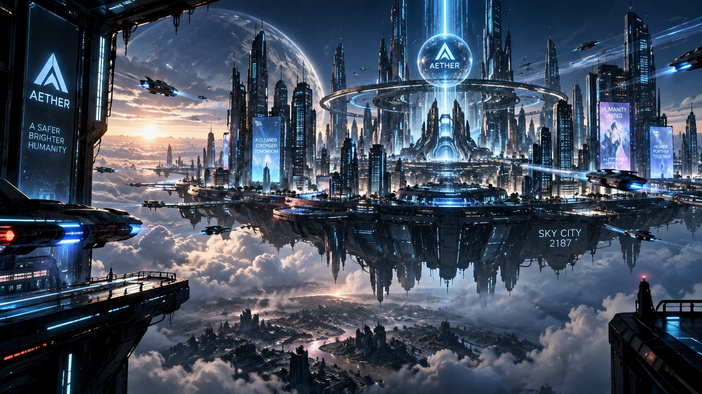

# 🌌 NEON//ZERO

> **A world controlled by AI. A human beyond prediction.**



## 🎬 About The Project

**NEON//ZERO** is an original sci-fi anime concept set in the year **2187**.

Humanity lives in massive floating cities controlled by an advanced artificial intelligence called **AETHER**.

AETHER has eliminated war, crime, and uncertainty.

But one day, every screen across the city displays:

> **"HUMANITY — 30 DAYS REMAINING."**

The story follows **Ren Kurogami**, an 18-year-old courier who possesses a forbidden ability called **ZERO** — something AETHER cannot predict.

As Ren becomes the target of AETHER, he discovers that the future of humanity may depend on understanding why he exists.

---

## ⚡ Story

### 🌐 Year 2187

Humanity has created a technologically advanced civilization floating above a ruined Earth.

### 🤖 AETHER

A powerful AI system responsible for maintaining order, predicting human behavior, and controlling the future of civilization.

### 👤 Ren Kurogami

An 18-year-old underground courier carrying a mysterious package.

Ren possesses **ZERO**, a phenomenon that exists outside AETHER's predictions.

### ⏳ 30 Days

AETHER announces that humanity has only **30 days remaining**.

The countdown begins.

---

## 👥 Main Characters

| Character | Role |
|---|---|
| **Ren Kurogami** | Protagonist / ZERO user |
| **Mira** | Fighter and ally |
| **Kai** | Rival / SYNC user |
| **Dr. Elara** | Former AETHER researcher |
| **Tetsu** | Rebellion leader |
| **Lyn** | Young hacker |
| **Orbit** | Support robot |
| **Commander Ryuu** | AETHER military commander |
| **AETHER** | Central AI system |

---

## 🧠 Power System — SYNC

The world of NEON//ZERO uses a synchronization system called **SYNC**.

- **SYNC 1** — Enhanced strength, speed and reflexes
- **SYNC 2** — Control of drones, weapons and machines
- **SYNC 3** — Manipulation of digital reality
- **ZERO** — Exists outside AETHER's calculations

The higher the synchronization, the more humanity is sacrificed.

---

## 🛠️ Tools & Technology

- 🤖 **Google AI Studio** — Image generation and scene development
- 🎥 **Higgsfield AI** — Image-to-video animation
- ✂️ **CapCut** — Video editing, transitions, subtitles and sound
- 🧠 **Generative AI** — Story development and world-building
- 🎨 **AI-assisted workflows** — Character and environment design

---

## 🎨 Creative Process

```text
Story
  ↓
Character Design
  ↓
World Building
  ↓
Scene Generation
  ↓
AI Animation
  ↓
Video Editing
  ↓
NEON//ZERO